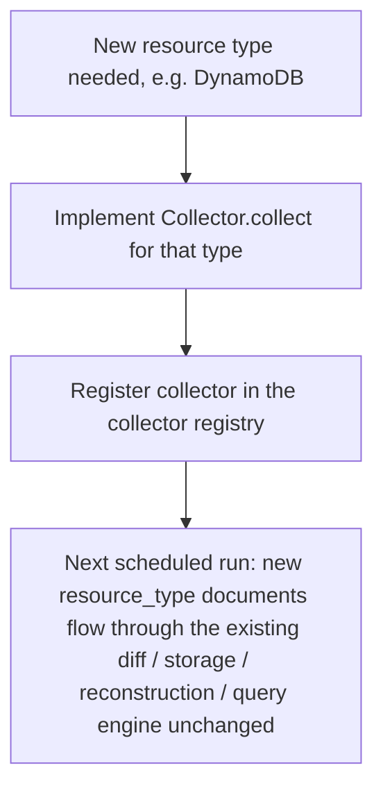
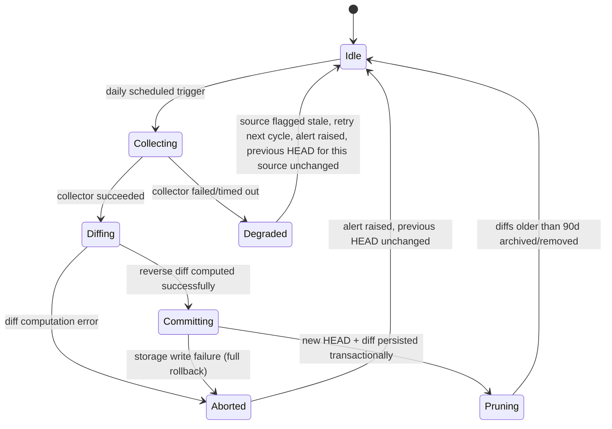
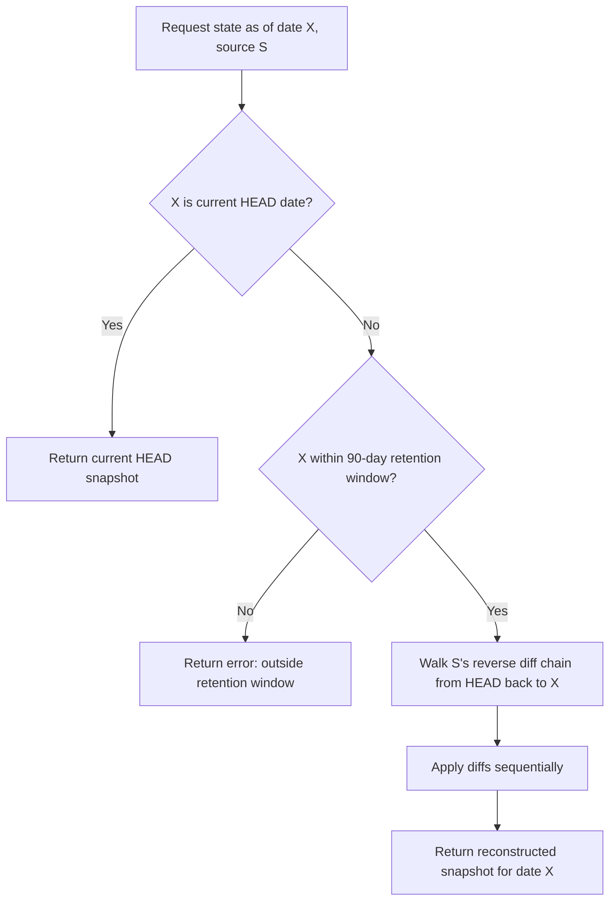
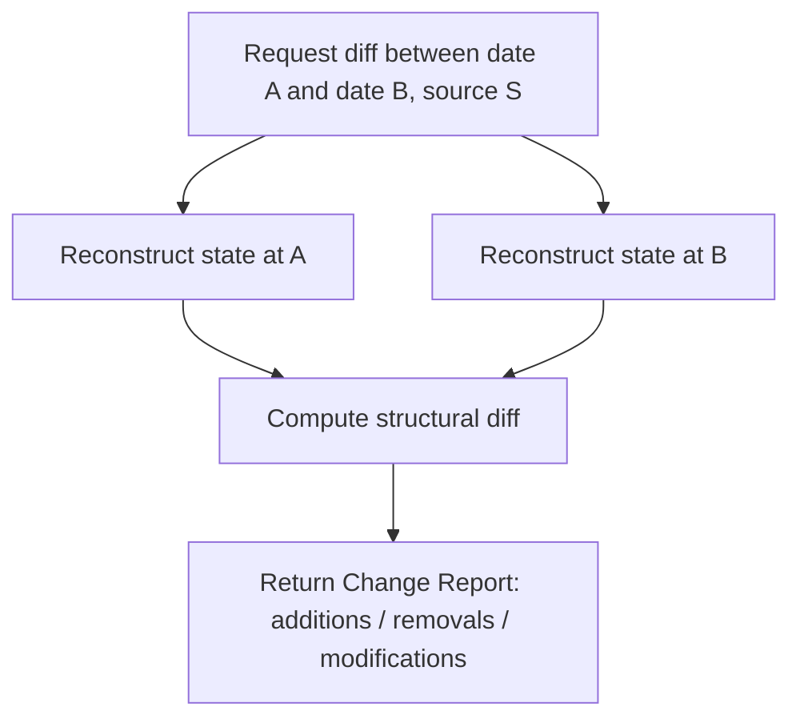

# Functional Specification

## 1. Problem Statement

Engineers investigating incidents have no single system of record showing what the company's infrastructure (AWS, Kafka, Databases, Kubernetes) looked like at any point in time, or what changed between two dates. Manually correlating consoles/logs across four different systems to answer "what changed right before this broke" is slow and unreliable. This solution captures daily snapshots of full environment configuration, stores only the current full state plus a 90-day chain of reverse diffs, and lets engineers reconstruct or diff any past state on demand to support root-cause investigation.

**Storage model:** Reverse incremental. The system holds one current full snapshot ("HEAD"). On each new capture, the diff between old-HEAD and new-HEAD is computed and stored as a reverse delta (how to go *back* from new to old); HEAD is then replaced by the new full state. Any past state within the retention window is reconstructed by replaying reverse deltas backward from HEAD.

**Primary use case:** Incident / root-cause investigation ("what changed right before this broke").

## 2. In-Scope

- Collectors for AWS, Kafka, Database, and Kubernetes — full raw configuration per resource (complete resource definitions, not summaries)
- Scheduled daily snapshot capture
- Reverse-diff storage engine: one current full snapshot ("HEAD") + chain of backward deltas
- Point-in-time reconstruction: "show me the environment as of date X" (within the 90-day window)
- Arbitrary diff view: "what changed between date A and date B," optimized for fast RCA lookback
- Current-state full inventory view
- 90-day bounded retention — diffs older than 90 days are pruned/archived

## 3. Out-of-Scope (v1)

- Automated remediation / auto-fix of drift
- Real-time change detection (batch/daily, not streaming)
- Proactive alerting/notifications on change
- Cost tracking/optimization recommendations
- Clouds/systems beyond AWS/Kafka/DB/Kubernetes
- Granular RBAC / per-field access control
- Retention beyond 90 days (no long-term archive tier in v1)

## 4. Measurable Objectives

- **O1:** Daily snapshot ingestion completes across all four source types within the nightly batch window, before business hours
- **O2:** Any date within the 90-day window reconstructs to 100% fidelity via diff replay against the source's full raw config
- **O3:** "What changed between A and B" query returns in under a few seconds for any two dates within the 90-day window — this is the primary RCA workflow and the key latency target
- **O4:** Diff storage per day stays a small fraction of a full-snapshot size under normal change volume; total 90-day storage footprint is bounded and predictable
- **O5:** Pruning of diffs older than 90 days does not corrupt the ability to reconstruct any date still inside the window

## 5. Approval Log

- **2026-08-25** — Problem statement, scope, and objectives approved by user (mhmiwa@gmail.com).
- **2026-08-25** — Inputs/Outputs/Interfaces and Core Behaviors sections (state machine, reconstruction/diff flows, collector plugin contract, validation criteria VC1–VC8) approved by user (mhmiwa@gmail.com).
- **2026-08-25** — AWS hybrid discovery model (generic discovery + specialized deep collectors, VC9) approved by user (mhmiwa@gmail.com).

## 6. Inputs, Outputs & Interfaces

### Input Vectors

Each collector runs on a daily schedule, one run per environment/account.

| Collector | Source | Scope (starter list — extensible, see Collector Plugin Contract) |
|---|---|---|
| AWS | Read-only AWS API calls (generic discovery + specialized deep collectors) | All resource types across the account, captured automatically via generic discovery; EC2, VPC, Security Groups, IAM, S3, RDS, Lambda, ELB/ALB additionally get specialized deep collectors for full raw-config fidelity — extendable via the Plugin Contract |
| Kafka | Admin API | Topics, partitions, configs, ACLs, broker configs, consumer groups — metadata only, never message payloads |
| Database | Schema introspection | Databases/schemas, tables/columns, indexes, roles/permissions, engine parameters — never row-level data |
| Kubernetes | Cluster API | Deployments, StatefulSets, Services, ConfigMaps, Secrets (metadata only), RBAC, CRDs, Ingress, across all in-scope clusters/namespaces |

**Secrets handling:** every collector captures secret *existence and metadata* (name, type, references, rotation timestamp) but never decrypted/raw secret values. Applies to K8s Secrets, AWS Secrets Manager/SSM SecureString, and DB credential fields.

### Discovery Mechanism (AWS)

AWS has no single native "list everything" API, so the AWS collector uses a hybrid discovery model:

1. **Generic discovery layer** — a broad, unified discovery mechanism (e.g. AWS Config aggregator, Resource Explorer, or Cloud Control API — exact API choice deferred to Step 3) enumerates every resource across every AWS service in scope automatically. No per-service code is required for a resource to be discovered — new AWS services appear automatically.
2. **Specialized deep collectors** — for resource types where the generic layer's config payload is insufficient to satisfy "full raw configuration" (e.g. EC2 instance full describe, IAM policy documents, RDS parameter groups, VPC route tables/security group rules), a specialized collector implementing the Collector Plugin Contract pulls the full native `Describe*`/`Get*` payload and supersedes the generic record for that resource.
3. Resources without a specialized collector are still captured — just at generic-layer fidelity, not a gap.

Kafka, Database, and Kubernetes collectors are already exhaustive by nature of their own APIs (list all topics / introspect all schemas / list all API resource types), so this hybrid model applies to AWS only.

### Outputs

- **Raw Snapshot Document** (per source, per environment): structured JSON of full raw config at capture time, tagged with source type, environment/account id, timestamp
- **Reverse Diff Document**: JSON-Patch-style field-level diff (old-HEAD ← new-HEAD direction), tagged with date and source type
- **Reconstructed State**: full snapshot as of a requested date, produced by replaying diffs backward from HEAD
- **Change Report**: structured additions/removals/modifications between two arbitrary dates

### External Dependencies

AWS APIs, Kafka Admin API, target database engines, Kubernetes API server(s) — each via read-only credentials. Exact SDK/auth mechanism is deferred to the Step 3 tech-stack selection.

### Test Mocking Strategy

Every collector is tested against fixture data, never a live external system: a fake/stubbed AWS API layer, a mocked Kafka admin client, fixture schema results for DB introspection, and a fake Kubernetes API client. The diff engine and reconstruction logic are pure functions over snapshot fixtures, requiring no external dependency to unit-test.

### Collector Plugin Contract (Extensibility)

To make adding a new resource type low-friction, every collector — for a new resource type on an existing source (e.g. a new AWS service) or an entirely new source category — implements one standard contract instead of the core engine growing type-specific logic:

```
Collector.collect(environment) -> List[ResourceDocument]

ResourceDocument = {
  source: string          # "aws" | "kafka" | "database" | "kubernetes" | ...
  resource_type: string   # e.g. "aws:ec2:instance", "k8s:deployment"
  resource_id: string     # stable unique id within (source, resource_type)
  raw_config: object      # full raw config, secrets redacted per policy
  captured_at: timestamp
}
```

Diffing, storage, the HEAD/reverse-diff chain, pruning, reconstruction, and the query engine all operate generically on `ResourceDocument` — none contain resource-type-specific logic, because field-level JSON Patch diffing works on any JSON shape. Onboarding a new resource type is two steps:



## 7. Core Behaviors, State Transitions & Verification

Each of the 4 sources has its own independent HEAD + diff chain (per the partial-failure decision below) — a bad day for one source doesn't block history for the others.

### Daily Snapshot Lifecycle



### Point-in-Time Reconstruction



### Change Report Between Two Dates



### Failure States

- **Collector failure** → source enters Degraded, that source's snapshot for the day is skipped, alert raised, retried next cycle; other 3 sources proceed normally
- **Diff computation error** → commit aborted, previous HEAD and diff chain for that source untouched, alert raised
- **Storage write failure during commit** → transactional: new HEAD + new diff persist together or not at all — never a partial write
- **Pruning failure** → does not block new snapshot ingestion; retried next cycle; alert if diffs exceed retention + grace period

### Validation Criteria

- **VC1 — Diff Reversibility:** for any (S_old, S_new) pair, applying the reverse diff to S_new reconstructs S_old exactly
- **VC2 — Chain Integrity:** replaying the full diff chain N days back from HEAD equals the known fixture snapshot from N days ago, for all N within the 90-day window
- **VC3 — Partial Failure Isolation:** a failure in one source's collector never blocks or corrupts the other three sources' snapshots for that day
- **VC4 — Pruning Safety:** after pruning diffs older than 90 days, every date still inside the window remains reconstructable; pruned dates fail cleanly (retention-window error), never silently corrupt
- **VC5 — Idempotency:** running collector + diff pipeline twice against an unchanged environment produces an empty/no-op diff
- **VC6 — Secrets Safety:** automated scan confirms no raw secret values ever appear in a stored snapshot or diff document
- **VC7 — Query Consistency:** reconstructed state for date X, diffed against reconstructed state for date X−1, matches the stored Change Report for that day exactly
- **VC8 — Extensibility:** adding a collector for a new resource type requires zero modification to the diff engine, storage layer, reconstruction logic, or query API — verified by a test that registers a fixture collector for a synthetic resource type and confirms diff/reconstruct/query all work against it with no core-engine changes
- **VC9 — Discovery Completeness:** a newly created AWS resource of an arbitrary/unseen type appears in the next snapshot via generic discovery alone, with no code changes required
